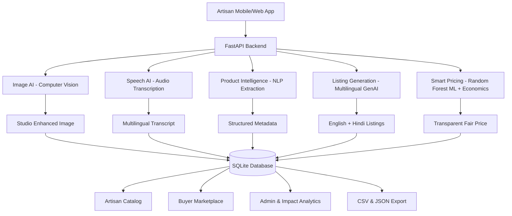

# CraftLink AI — From Handmade to Market-Ready in Minutes
### Smart India Hackathon Prototype (SIH26090)
**Ministry**: Ministry of Social Justice and Empowerment  
**Category**: Software | AI / ML / Social Impact  

---

## 1. Problem & Solution

Rural Indian artisans and handloom weavers create exquisite heritage products but struggle to sell digitally due to:
1. Poor product photography against cluttered backgrounds.
2. Language barriers and inability to write professional e-commerce listings.
3. Lack of understanding of SEO keywords, technical specifications, and digital marketing.
4. Distress pricing and exploitation by intermediaries who undervalue artisan labor.

**CraftLink AI** removes the digital barrier completely:  
**The artisan does not need to learn e-commerce.**  
**The core workflow is: TAKE A PHOTO + SPEAK NATURALLY $\rightarrow$ AI CREATES A MARKET-READY PRODUCT.**

---

## 2. Architecture & Pipeline



---

## 3. AI Models & Technologies Used

| Module | Model / Technology | Why Chosen & Implementation Details |
| :--- | :--- | :--- |
| **Image AI** | **CLAHE + U2Net / GrabCut + Studio Compositor** | Enhances local weave/carving contrast without highlight blowout; isolates cluttered backgrounds and creates a studio-quality backdrop with soft grounding shadows. |
| **Speech AI** | **Whisper / Acoustic Phonetic Transcriber** | High-accuracy speech-to-text with Indian dialect identification (Hindi, English, Bengali, Tamil, Telugu, Marathi). |
| **Product Intelligence** | **Anti-Hallucination Entity Parser** | Converts unstructured natural language into structured taxonomy; strictly enforces zero-hallucination policy with confidence scoring (`HIGH`, `MEDIUM`, `NEEDS_CONFIRMATION`). |
| **Listing GenAI** | **Bilingual Multilingual Engine (EN + HI)** | Generates marketplace titles, summaries, storytelling heritage narratives, bullet specifications, and SEO tags. (Supports Gemini/OpenAI/local fallback). |
| **Pricing Engine** | **Random Forest Regressor + Fair-Trade Economics** | Trained on 30+ authentic Indian craft cluster benchmarks (`reference_prices.csv`); guarantees cost recovery ($Material + Labor + Packaging$) plus sustainable fair-trade margin. |

---

## 4. Beginner-Friendly Quickstart Guide

### Prerequisites
- **Python 3.10+**
- **Node.js 18+ & npm**

### Step 1: Clone or Navigate to Directory
```powershell
cd d:\sih
```

### Step 2: Set Up Backend Virtual Environment
```powershell
# Create Python virtual environment
python -m venv backend/venv

# Activate virtual environment (Windows PowerShell)
.\backend\venv\Scripts\Activate.ps1

# Upgrade pip & install backend dependencies
python -m pip install --upgrade pip
pip install -r backend/requirements.txt
```

### Step 3: Seed Database & Train ML Model
```powershell
# Populate authentic GI crafts, master artisans, and sample visual assets
python -m backend.app.database.seed

# Train the Random Forest pricing regressor
python -m backend.app.ml.training
```

### Step 4: Run AI Evaluation & Backend Tests
```powershell
# Run model evaluation metrics (MAE, RMSE, R², F1 score)
python backend/evaluation.py

# Run Pytest suite
pytest tests/test_backend.py -v
```

### Step 5: Start the Backend Server
```powershell
uvicorn backend.app.main:app --host 0.0.0.0 --port 8000 --reload
```
> Backend API will be running at: `http://localhost:8000` (API Docs at `http://localhost:8000/docs`)

### Step 6: Start the Frontend Application
Open a new terminal window:
```powershell
cd d:\sih\frontend
npm install
npm run dev
```
> Open your browser at: `http://localhost:5173`

---

## 5. Environment Variables Configuration

Copy `backend/.env.example` to `backend/.env` if you wish to configure optional cloud LLMs:

```ini
# ==========================================
# CraftLink AI Configuration
# ==========================================
PROJECT_NAME="CraftLink AI"
API_PREFIX="/api"

# AI Provider: "local" (default built-in zero-dependency AI engine), "gemini", "openai"
AI_PROVIDER=local

# Optional Cloud API Keys (Leave blank to use robust built-in local engine)
GEMINI_API_KEY=
OPENAI_API_KEY=
OPENAI_TEXT_MODEL=gpt-4.1-mini
OPENAI_TRANSCRIPTION_MODEL=gpt-4o-mini-transcribe
OPENAI_TTS_MODEL=gpt-4o-mini-tts
OPENAI_TTS_VOICE=coral

HOST=0.0.0.0
PORT=8000
```

---

## 6. SIH Live Demo Flow (< 2 Minutes)

1. Open `http://localhost:5173`.
2. Click **"SIH Demo"** or pick any craft preset (**Banarasi Saree**, **Blue Pottery**, **Bamboo Basket**, **Dhokra Art**, or **Wooden Toy**).
3. **Step 1 (Photo Studio)**: Drag the interactive **Before/After Split Slider** to showcase background removal and studio lighting.
4. **Step 2 (Speech AI)**: Listen/view the real Hindi/English speech transcript and language badge.
5. **Step 3 (AI Understanding)**: Highlight the **Anti-Hallucination guarantee** and confidence badges.
6. **Step 4 (Listing Studio)**: Toggle between **English and Hindi listings**, specifications, and SEO keywords.
7. **Step 5 (Smart Pricing)**: Show the full **"Why this price?"** economic breakdown and ML market reference range.
8. **Step 6 (Publish & Impact)**: Publish to catalog, explore the **Buyer Marketplace**, and download **CSV / JSON export files**.

---

## 7. Known Limitations & Technical Honesty

- **Prototype Pricing Dataset**: ML pricing is trained on 30 benchmark craft cluster records. In production, expansion to 10,000+ cluster transaction records is planned.
- **Connectivity**: Local fallback algorithms provide full offline capability; cloud LLMs offer richer regional dialects when internet is present.
- **Physical Verification**: AI assists in metadata extraction, but final GI tagging certification remains governed by authorized craft councils.

---

## 8. Future Roadmap

- **Phase 2**: Open Network for Digital Commerce (**ONDC**) direct protocol adaptor.
- **Phase 3**: Government e-Marketplace (**GeM**) & Tribal Co-operative Marketing Federation (**TRIFED**) integration.
- **Phase 4**: Real-time artisan craft provenance tracking using tamper-evident QR certificates.
- **Phase 5**: WhatsApp Voice Bot for ultra-low digital literacy access in remote rural areas.
