# CraftLink AI

> AI-assisted product photography, voice-first cataloging, transparent price guidance, and digital market linkage for Indian artisans.

CraftLink AI is a working full-stack prototype for Smart India Hackathon 2026 problem statement **SIH26090: AI-Driven Market Linkage and Smart Cataloging Mobile Application for Marginalized Artisans**, proposed by the Ministry of Social Justice and Empowerment (MoSJE).

The product is designed for artisans who may have limited experience with English, typing, professional photography, pricing, or e-commerce forms. A seller uploads or captures product photographs, answers a short guided interview by voice or text, reviews the extracted facts and generated listing, receives an explained price recommendation, and submits the product for human approval. Approved products become available in the buyer marketplace.

This README deliberately distinguishes implemented functionality from experimental and planned integrations. It does not claim certified ONDC, GeM, Bharat-TULIP, production authentication, or validated model accuracy where those capabilities do not yet exist.

## Contents

- [Product walkthrough](#product-walkthrough)
- [Implementation status](#implementation-status)
- [Core user journeys](#core-user-journeys)
- [AI and automation pipeline](#ai-and-automation-pipeline)
- [Architecture](#architecture)
- [Technology stack](#technology-stack)
- [Local setup](#local-setup)
- [Configuration](#configuration)
- [API overview](#api-overview)
- [Data and persistence](#data-and-persistence)
- [Internationalization and accessibility](#internationalization-and-accessibility)
- [Testing and verification](#testing-and-verification)
- [Known limitations](#known-limitations)
- [Production roadmap](#production-roadmap)
- [Project structure](#project-structure)

## Why CraftLink exists

Traditional artisans frequently depend on periodic exhibitions and intermediaries because creating a competitive online listing requires several separate skills:

- photographing a product against a clean background;
- writing searchable product copy;
- translating craft knowledge into marketplace fields;
- calculating a sustainable selling price;
- maintaining stock, orders, and fulfilment;
- understanding unfamiliar digital interfaces.

CraftLink combines those tasks into one assisted workflow. The system keeps the artisan in control: extracted facts can be edited, the recommended price can be reviewed, and a listing does not become public until an operations reviewer approves it.

## Product walkthrough

The screenshots below were captured from the running local application at `http://localhost:5173`. They show development catalog records in the current local database; a fresh database is not automatically populated by the application.

### Buyer marketplace

Buyers can browse by craft, state, product, or maker, inspect available stock, add products to a persistent cart, check out using cash on delivery, and track the resulting order.

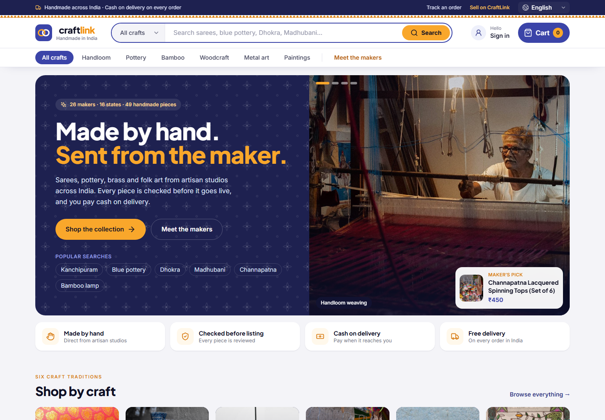

### Product details and buyer gallery

The product view presents the seller, price, stock, craft attributes, description, fulfilment information, and multiple product photographs when supplied. Listing narration can be replayed through the voice service.

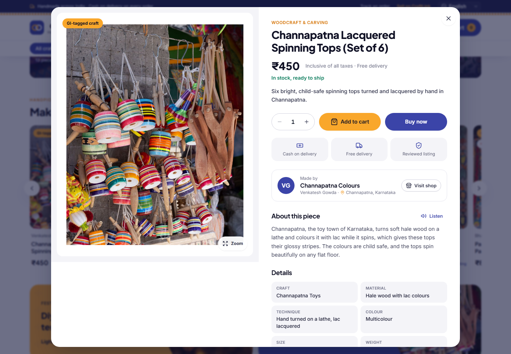

### Seller workspace

The seller workspace derives inventory, approval, fulfilment, and sales information from the backend database. It also provides a spoken summary for users who prefer audio guidance.

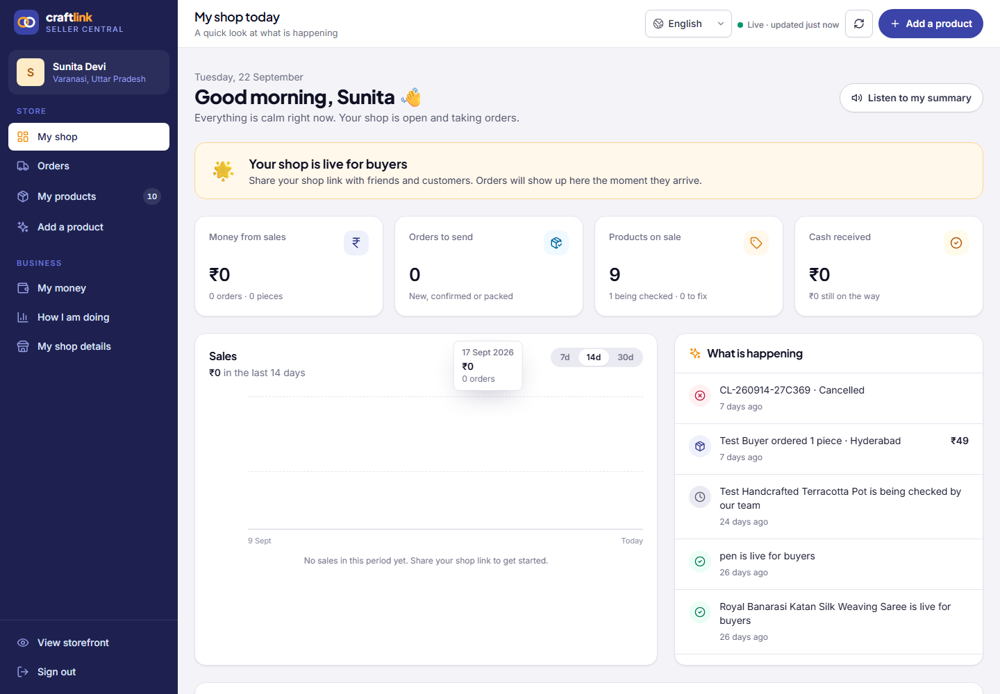

### AI product-photo studio

Sellers can upload up to six product views or use the device camera. Each image is segmented, conservatively light-balanced, and composited onto one of ten backgrounds or an imported custom background. A before/after slider keeps the transformation visible to the seller.

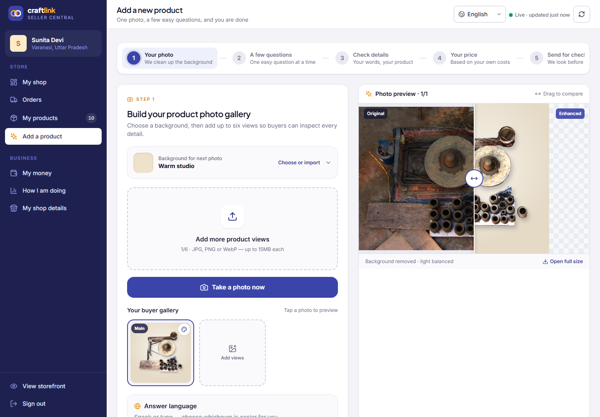

### Guided multilingual interview

Only one question appears at a time. The assistant can speak the question, and the artisan can answer by microphone or text. Previous and Next controls make correction possible without restarting the listing.

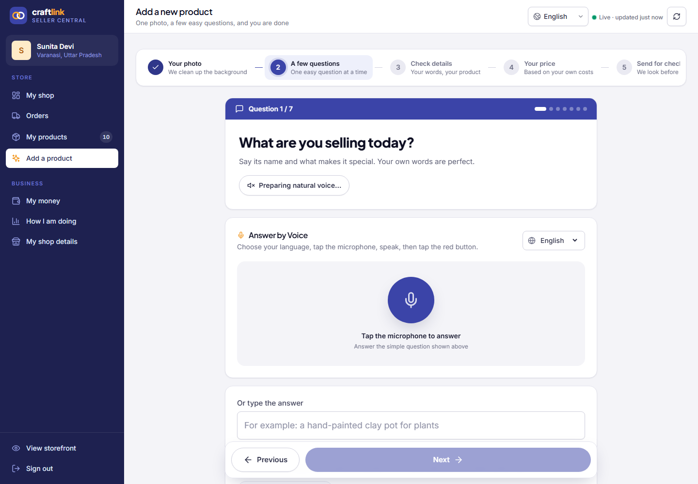

### Operations review

New products enter a manual review queue. Operations users can inspect the image, listing facts, price, cost basis, and stock before approving or returning the product.

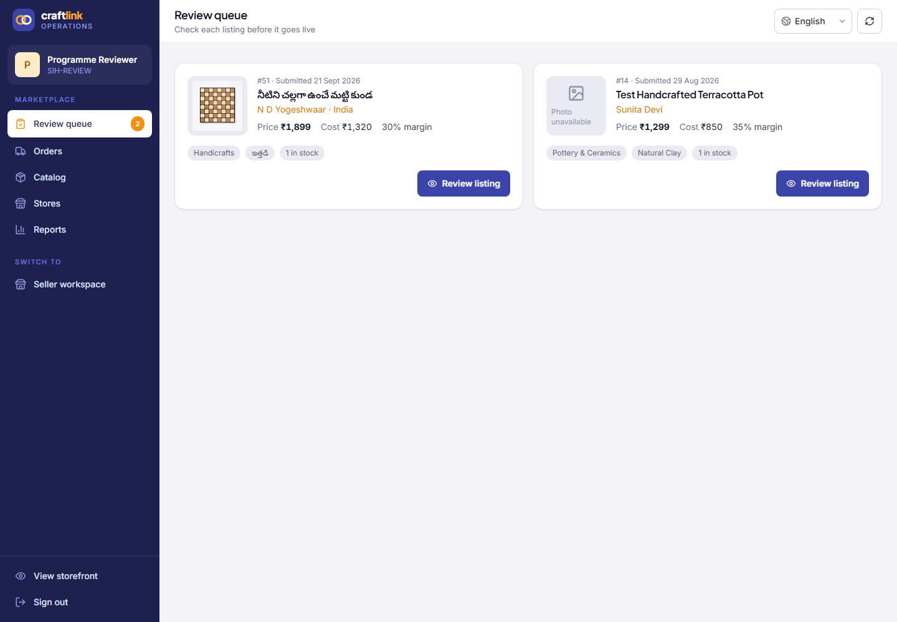

### Bulk buyer enquiries

Artisans receive institutional requests in a dedicated workspace with quantity, target price, delivery location, deadline, buyer contact, and quote controls.

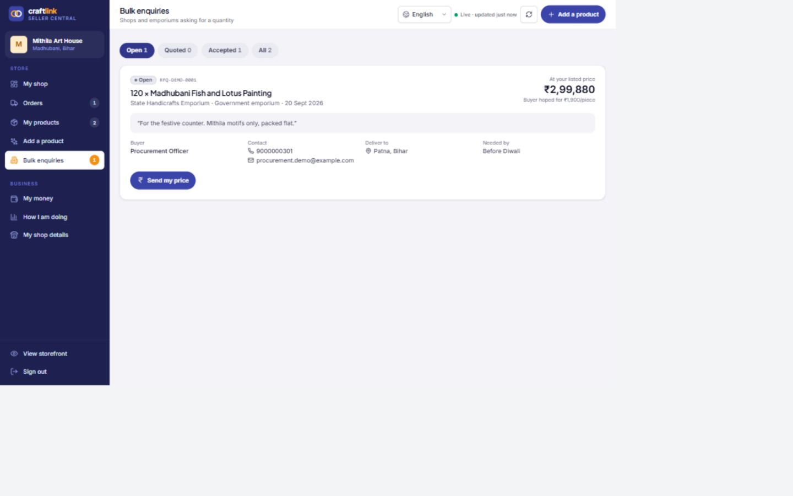

### Programme impact

The operations dashboard counts onboarding, live listings, artisan earnings, accepted bulk value, geographic reach, languages, verification, and fulfilment from database records.

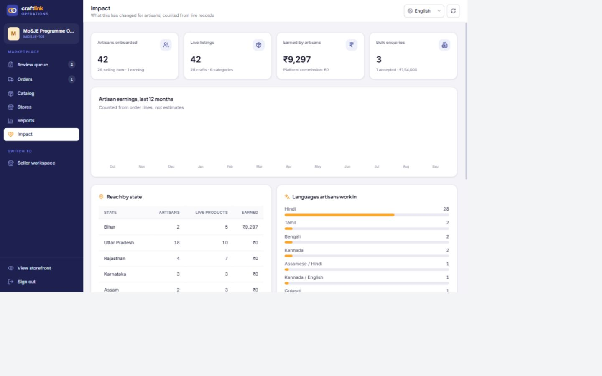

### Mobile application

CraftLink now ships as an installable PWA and a Capacitor Android application. The phone layout uses a persistent, thumb-sized task bar and retains the full nine-language interface.

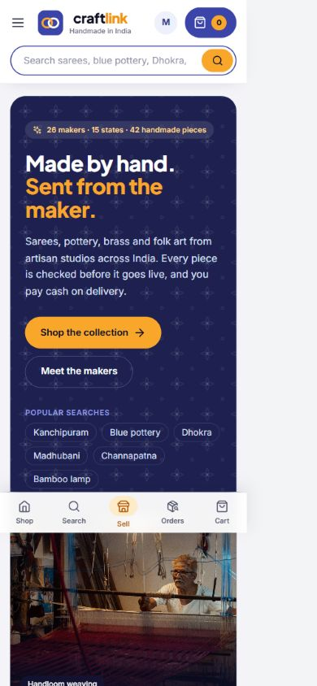

## Implementation status

| Capability | Status | Current implementation |
| --- | --- | --- |
| Buyer marketplace | Implemented | Search, filters, product details, cart, stock-aware COD checkout, and order tracking |
| Seller workspace | Implemented | Store overview, inventory, orders, fulfilment, payouts view, insights, and profile |
| AI photo cleanup | Implemented | Background segmentation, mask-quality checks, light/color correction, studio compositing, and before/after review |
| Multi-image listings | Implemented | Up to six enhanced views, primary-image selection, per-image background changes, and buyer gallery |
| Guided catalog interview | Implemented | Six evidence questions plus seller confirmation, one question per page, voice or text answers |
| Interface languages | Implemented | English, Hindi, Telugu, Tamil, Bengali, Marathi, Kannada, Gujarati, and Malayalam |
| Question voice | Implemented with fallback | Edge neural TTS or optional OpenAI TTS; browser speech synthesis is the final fallback |
| Speech recognition | Implemented with fallback | Browser live captions plus recorded-audio transcription through local Faster Whisper or optional OpenAI transcription |
| Generated listing languages | Partial | English, Hindi, and Telugu fields are stored; the complete UI supports nine languages |
| Price guidance | Experimental | Cost floor plus a prototype ML benchmark model; bundled benchmark rows are synthetic and are not valid live-market evidence |
| Product classification from image | Limited | The image service currently reports broad visual features, not a validated craft-category classifier |
| Human approval | Implemented | New products enter `Pending Approval`; operations can approve or return them |
| B2B quotation workflow | Implemented | Buyer RFQ, seller inbox and quotation, buyer decision, and status tracking |
| Impact metrics | Implemented | Database-derived programme dashboard with earnings, reach, languages, verification, and exports |
| ONDC linkage | Export prototype | An ONDC-style catalog feed exists; it is not a certified network integration |
| GeM linkage | Export prototype | A GeM-style CSV exists; it is not a direct GeM connection |
| Authentication and RBAC | Prototype only | Current local login/token behavior is for demonstration and must not be used on the public internet |
| Cross-platform mobile app | Implemented | Installable PWA plus Capacitor Android project, camera/microphone permissions, phone navigation, and a verified debug APK |
| Offline behavior | Partial | The app shell, public catalog, and product media can be cached; Android also bundles ten stocked sample products so the buyer screen is never empty; writes still require a backend connection |
| Containerized deployment | Implemented | A multi-stage Dockerfile serves the built frontend from the API as one service, with a Render blueprint that keeps the database, uploads, and models on one persistent disk |
| Production hardening | Not complete | PostgreSQL, migrations, object storage, monitoring, notification providers, and production authentication are pending |

## Core user journeys

### Artisan listing flow

1. Sign in to or create an artisan profile.
2. Upload product photographs or take pictures with the camera.
3. Select a background for the next photograph.
4. Review the original and enhanced result.
5. Choose an answer language.
6. Answer the guided product questions by voice or text:
   - what the product is and why it is special;
   - primary material;
   - production time;
   - material cost per unit;
   - labour cost per unit;
   - packaging cost per unit.
7. Confirm or correct the extracted facts.
8. Review generated English, Hindi, and Telugu listing copy.
9. Review the price breakdown, assumptions, and confidence information.
10. Enter exact stock and submit the product.
11. Wait for operations approval before publication.

### Buyer flow

1. Search or browse approved products.
2. Open a product and inspect its gallery, seller, attributes, price, and stock.
3. Add to cart or buy immediately.
4. Submit a cash-on-delivery checkout.
5. Track the order using the order number and checkout email.

### Operations flow

1. Open the pending-product queue.
2. Inspect the product image, listing facts, costs, price, and stock.
3. Approve the product with a review note or return it with a reason.
4. Monitor the catalog and valid order-state transitions.

## AI and automation pipeline

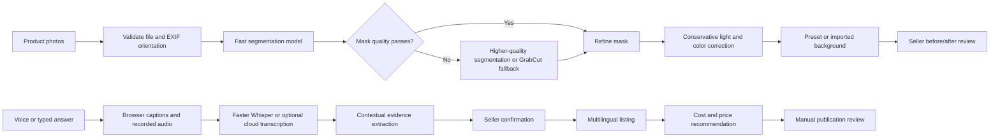

### Image processing

The image endpoint validates the file, preserves the original, attempts fast segmentation, measures foreground quality, invokes the primary model or GrabCut fallback when needed, refines the alpha mask, corrects the image conservatively, and composites the foreground onto the selected background.

Default configuration:

- fast path: `u2netp`;
- primary path: `birefnet-general-lite`;
- Windows acceleration: ONNX Runtime OpenVINO when available;
- CPU fallback: supported.

The API returns both URLs, segmentation engine, mask score, score components, dominant colors, broad visual features, and stage latency. The displayed image score is a mask-quality signal, not a statement that the picture is 95% commercially correct.

### Voice interaction

The browser provides immediate captions where Web Speech is supported while recording the real microphone stream. The recording is sent to the backend for transcription. The default strategy runs the smaller local Whisper model first and uses the larger configured model when confidence is weak. OpenAI transcription is used only when explicitly configured.

Questions use neural TTS when available. Generated speech is cached in memory by language and text. Browser speech synthesis keeps the flow usable when the neural request is unavailable.

### Product understanding

The interview is server-stateless: each turn supplies the confirmed attributes and costs from previous turns. This prevents cross-user conversation mixing and allows a client to resume the flow.

The local product-intelligence engine includes a small craft taxonomy and contextual parsing rules. Missing information remains missing instead of being silently presented as seller-confirmed. An optional external text provider can generate listing copy, with a deterministic local generator as fallback.

### Pricing semantics

The price result is a recommendation, not a guaranteed valuation.

```text
direct cost = material cost + labour cost + packaging cost
minimum sustainable price = direct cost × 1.18
cost-based target = direct cost × margin × craft complexity factor
suggested retail price = rounded blend of cost target and benchmark model
```

The bundled `reference_prices.csv` was generated for prototype development. It is not live marketplace data and must not be cited as an authentic market benchmark. Production work requires source-labelled comparables, collection dates, held-out evaluation, uncertainty intervals, and human review for thin categories.

### Confidence semantics

- **Image confidence:** foreground-mask measurements.
- **Transcription confidence:** word/language probabilities where available.
- **Interview readiness:** required questions completed.
- **Human confirmation:** the artisan's explicit confirmation.
- **Pricing confidence:** benchmark coverage and similarity.

Human confirmation must never be converted into a model-accuracy claim.

## Architecture

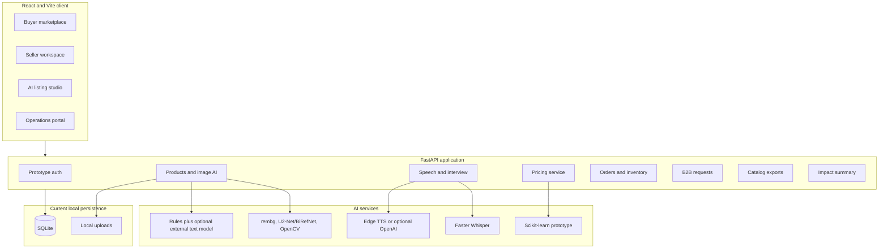

SQLite and local file storage simplify development and judging demonstrations, but they are not the intended production topology. A public deployment should use PostgreSQL, managed object storage, schema migrations, background workers, secure secrets, backups, and observability.

## Technology stack

### Frontend

- React 18, Vite 5, and Tailwind CSS
- Lucide React icons
- browser MediaRecorder, camera, speech recognition, and speech synthesis APIs
- plain JavaScript/JSX

### Backend and AI

- Python 3.11, FastAPI, Pydantic, and SQLAlchemy
- SQLite for the current local build
- Pillow, OpenCV, rembg-compatible models, and OpenVINO support
- Faster Whisper and Edge TTS
- pandas and scikit-learn

## Local setup

### Prerequisites

- Python 3.11 recommended
- Node.js 20 recommended
- npm
- approximately 2–4 GB free for dependencies and downloaded model weights
- microphone and camera for complete device testing

### 1. Clone the repository

```bash
git clone https://github.com/yogeshwardev/SIH-project.git
cd SIH-project
```

The Windows examples below assume the repository is at `D:\sih`; adjust the path for your checkout.

### 2. Create the backend environment

```powershell
cd D:\sih
py -3.11 -m venv backend\venv
.\backend\venv\Scripts\python.exe -m pip install --upgrade pip
.\backend\venv\Scripts\python.exe -m pip install -r backend\requirements.txt
```

### 3. Configure and run the API

```powershell
Copy-Item backend\.env.example backend\.env
.\backend\venv\Scripts\python.exe -m uvicorn backend.app.main:app --host 127.0.0.1 --port 8000
```

The default local configuration does not require a paid cloud key. Do not commit `backend/.env`.

- API root: `http://localhost:8000/`
- health: `http://localhost:8000/health`
- interactive API documentation: `http://localhost:8000/docs`

The first image or voice request may take longer while model weights are downloaded or loaded.

### 4. Run the frontend

Open a second terminal:

```powershell
cd D:\sih\frontend
npm install
npm run dev
```

Open `http://localhost:5173`. Vite proxies `/api` and `/uploads` to FastAPI.

After the one-time dependency setup, Windows users can start both services with:

```powershell
.\start-craftlink.ps1
```

If a fresh database has no published products, the backend automatically adds the documented sample catalog. The storefront also retries while the API is starting, so opening the browser a few seconds early does not leave an empty collection.

### Demo sign-in accounts

The sign-in dialog shows these accounts and signs in with a single tap. The
three documented demo identities are verified on-device, so judging can enter
the buyer, seller, and operations workspaces even when a physical phone cannot
reach the development API.

| Role | User ID | Password |
| --- | --- | --- |
| Buyer | `buyer@craftlink.in` | `CraftLink@123` |
| Seller | `mithila@sample.craftlink.in` | `CraftLink@123` |
| Operations | `MOSJE-101` | `CraftLink@123` |

These credentials are for local judging demonstrations only. The current authentication layer remains a prototype and must be replaced before public deployment.

### 5. Build the Android app

Install Android Studio/SDK and JDK 21, then run:

```powershell
cd D:\sih\frontend
$env:JAVA_HOME='C:\Program Files\Java\jdk-21'
$env:ANDROID_HOME="$env:LOCALAPPDATA\Android\Sdk"
npm run android:debug
```

The debug APK is written to `frontend/android/app/build/outputs/apk/debug/app-debug.apk`. Its checked-in debug environment targets `http://10.0.2.2:8000/api`, the Android Emulator route to the host API. On a physical phone, the bundled demo login, catalog, photos, seller inventory, and operations catalog remain available offline. AI processing, checkout, registration, and database writes still require a deployed backend; set `VITE_API_BASE` to its HTTPS URL before a release build, using `frontend/.env.mobile.example` as the template.

The debug build is also served from `http://localhost` rather than the usual `https://localhost`: the dev API is plain HTTP, and from a secure origin the WebView blocks every product photo on it as mixed content. `frontend/scripts/android-debug-scheme.mjs` applies that override to the debug APK only, after `cap sync` and before Gradle packages it, so `capacitor.config.json` keeps the HTTPS scheme a release build needs. The API must allow that origin — `CORS_ORIGINS` in `backend/.env` includes `http://localhost` and `https://localhost` by default.

Verified on an Android emulator: the installed APK loads the catalog, renders product photos from the host API, and reports no console, CORS, or mixed-content errors.

## Configuration

Configuration is loaded from `backend/.env`.

| Variable | Default | Purpose |
| --- | --- | --- |
| `AI_PROVIDER` | `local` | Selects the local or configured external provider path |
| `OPENAI_API_KEY` | empty | Enables configured OpenAI text, transcription, and TTS paths |
| `OPENAI_TEXT_MODEL` | `gpt-4.1-mini` | Optional listing model |
| `OPENAI_TRANSCRIPTION_MODEL` | `gpt-4o-mini-transcribe` | Optional cloud transcription model |
| `OPENAI_TTS_MODEL` | `gpt-4o-mini-tts` | Optional cloud speech model |
| `LOCAL_WHISPER_FAST_MODEL` | `base` | Fast local transcription pass |
| `LOCAL_WHISPER_MODEL` | `small` | Accuracy fallback model |
| `LOCAL_WHISPER_DEVICE` | `cpu` | Faster Whisper device |
| `VOICE_MODEL_PRELOAD` | `true` | Warm only the fast Whisper model; the larger accuracy model loads on low-confidence fallback |
| `IMAGE_FAST_SEGMENTATION_MODEL` | `u2netp` | Fast segmentation model |
| `IMAGE_SEGMENTATION_MODEL` | `birefnet-general-lite` | Primary segmentation model |
| `IMAGE_FAST_ACCEPT_CONFIDENCE` | `0.95` | Fast-path threshold, not a marketing accuracy score |
| `IMAGE_MODEL_PRELOAD` | `true` | Warm image models during startup |
| `IMAGE_ENABLE_OPENVINO` | `true` | Use supported Windows OpenVINO acceleration |
| `CORS_ORIGINS` | local Vite origins | Comma-separated browser origins |
| `DATABASE_URL` | local SQLite | SQLAlchemy database URL |

## API overview

All application routes use `/api`.

### Image and catalog AI

| Method | Endpoint | Purpose |
| --- | --- | --- |
| `POST` | `/products/image-enhance` | Enhance one image and apply a background |
| `POST` | `/products/image-rebackground` | Re-render a saved original with another background |
| `POST` | `/products/extract-information` | Convert a transcript into structured attributes |
| `POST` | `/products/generate-listing` | Produce multilingual listing copy |
| `POST` | `/products/price-recommendation` | Calculate an explained recommendation |
| `POST` | `/products/create` | Persist the seller-confirmed listing |
| `GET` | `/products` | Search and filter products |
| `PUT` | `/products/{product_id}` | Update product or inventory fields |

### Speech

| Method | Endpoint | Purpose |
| --- | --- | --- |
| `POST` | `/speech/transcribe` | Transcribe uploaded audio |
| `POST` | `/speech/synthesize` | Generate spoken audio |
| `POST` | `/speech/product-interview` | Continue the guided interview |
| `GET` | `/speech/capabilities` | Report active speech capabilities |

### Marketplace operations

| Method | Endpoint | Purpose |
| --- | --- | --- |
| `POST` | `/orders/checkout` | Server-validate stock and create an order |
| `GET` | `/orders/track/{order_number}` | Track an order with checkout email |
| `PUT` | `/orders/{order_number}/status` | Apply a fulfilment transition |
| `GET` | `/admin/pending-products` | Load the manual review queue |
| `POST` | `/admin/approve/{product_id}` | Approve a valid listing |
| `POST` | `/admin/reject/{product_id}` | Return a listing with a reason |
| `GET/POST` | `/bulk-requests` | Create and list B2B requests |
| `POST` | `/bulk-requests/{reference}/quote` | Seller quotation |
| `POST` | `/bulk-requests/{reference}/decision` | Buyer decision |
| `GET` | `/impact/summary` | Database-derived programme metrics |

### Export feeds

| Method | Endpoint | Meaning |
| --- | --- | --- |
| `GET` | `/export/csv` | General catalog CSV |
| `GET` | `/export/json` | Structured catalog JSON |
| `GET` | `/export/ondc.json` | ONDC-style envelope; not certified connectivity |
| `GET` | `/export/gem.csv` | GeM-style sheet; not direct GeM connectivity |

## Data and persistence

The application stores artisan profiles, product originals and enhancements, galleries, listing attributes, stock and approval state, orders and line-item snapshots, and B2B quotation records.

### Inventory guarantees

- Product creation requires an existing artisan and explicit stock.
- New products should enter `Pending Approval`.
- Buyer catalog calls show published products by default.
- Checkout reloads products and prices on the server.
- Checkout rejects unpublished or insufficient-stock products.
- Stock deduction and order creation occur in one transaction.
- Eligible cancellation restores stock.
- COD becomes paid only when delivered.

### Development catalog

The repository contains optional catalog utilities for local presentation data. They are not part of normal application startup. The active SQLite database may contain records created during development. Production must use verified beneficiary and product onboarding.

## Internationalization and accessibility

| Language | UI code | Speech locale |
| --- | --- | --- |
| English | `en` | `en-IN` |
| Hindi | `hi` | `hi-IN` |
| Telugu | `te` | `te-IN` |
| Tamil | `ta` | `ta-IN` |
| Bengali | `bn` | `bn-IN` |
| Marathi | `mr` | `mr-IN` |
| Kannada | `kn` | `kn-IN` |
| Gujarati | `gu` | `gu-IN` |
| Malayalam | `ml` | `ml-IN` |

Regional bundles load on demand. Tests verify complete shared translation coverage and speech-locale presence.

Accessibility-oriented behavior includes one question per page, interchangeable voice/text answers, visible navigation, large primary controls, labels beside icons, focus-managed dialogs, ARIA labels and live regions, and explicit seller confirmation. Formal WCAG and assistive-technology validation remain pending.

## Testing and verification

### Frontend

```powershell
cd D:\sih\frontend
npm test
npm run build
```

The tests cover all nine languages, translation completeness, gallery safety, price fallbacks, voice selection, and cancellation of stale audio. Latest local results:

- **14/14 frontend tests passed**
- **production build passed**

### Backend

```powershell
cd D:\sih
.\backend\venv\Scripts\python.exe -m pytest tests\test_backend.py -q
```

Latest local result: **27 backend tests passed**.

The Android debug package also completed `assembleDebug` successfully. The generated APK is approximately 7 MB.

### AI evaluation warning

`backend/evaluation.py` is out of sync with the pricing CSV schema and currently fails on a missing `suggested_market_price` column. Do not quote model accuracy from that script until it is repaired and rerun against a real held-out dataset.

### Continuous integration

`.github/workflows/ci-cd.yml` runs backend tests and the frontend build on `main` pushes and pull requests. Its final job verifies the build artifact; it does not deploy to a host.

## Known limitations

### Security

- Passwords are not verified or hashed.
- Buyer sessions are held in memory.
- Seller login can create a local profile.
- Admin access keys are not genuinely validated.
- Returned tokens are not signed credentials.
- Sensitive seller fields lack production protection.
- API routes do not enforce production RBAC.

Do not expose the current build to the public internet with real personal or financial information.

### AI evidence

- No representative image-mask benchmark has been completed.
- No per-language Word Error Rate evaluation has been completed.
- The local craft taxonomy is small.
- The pricing reference rows are synthetic.
- The evaluator currently fails.
- Image confidence measures mask quality, not conversion or commercial correctness.

### Mobile and offline

- PWA installation and an Android shell are implemented; Play Store signing and release publishing are not.
- The service worker caches only the app shell and public catalog/media. There is no offline write queue or draft synchronization yet.
- Camera and microphone support depend on browser capability and permission.
- Edge neural TTS needs network access.
- The fast Whisper model warms in the background; a low-confidence answer may still pay the one-time larger-model load cost.

### Commerce and linkage

- Only COD checkout is implemented.
- Payment, refunds, tax, shipping rates, carrier labels, notifications, and returns are pending.
- ONDC and GeM outputs are prototypes, not certified integrations.
- Bharat-TULIP publishing is not implemented.
- Production B2B notifications, procurement verification, and settlement remain pending.

## Production roadmap

### Selection-critical

1. Replace prototype login with persisted accounts, password hashing, signed sessions/JWT, recovery, and RBAC.
2. Repair the standalone AI evaluator and validate it against held-out real data.
3. Build a real artisan-image benchmark and report IoU, Dice, boundary F1, failure rate, and device latency.
4. Measure speech Word Error Rate and extracted-field accuracy with target-language speakers.
5. Replace synthetic price rows with source-labelled, date-stamped comparables.
6. Add saved drafts, background synchronization, and signed Play Store releases.
7. Complete one real staging or partner-led marketplace integration.
8. Pilot B2B quotation and MoSJE impact workflows with verified programme users.
9. Run moderated artisan usability sessions and report task completion, corrections, time, and assistance required.

### Production infrastructure

- PostgreSQL and Alembic migrations
- object storage and signed media URLs
- asynchronous AI jobs
- malware scanning and media retention controls
- SMS, email, or WhatsApp notifications
- logs, traces, metrics, alerts, and audit trails
- rate limiting and abuse prevention
- encrypted secrets and sensitive fields
- backup, restore, and disaster recovery
- privacy, consent, retention, returns, and marketplace terms
- security and accessibility testing

## Project structure

```text
sih/
├── backend/
│   ├── app/
│   │   ├── api/               # FastAPI routes
│   │   ├── database/          # SQLAlchemy setup and optional seed tools
│   │   ├── ml/                # Prototype pricing model
│   │   ├── models/            # Database entities
│   │   ├── schemas/           # Request and response models
│   │   └── services/          # Image, speech, interview, listing, pricing
│   ├── data/                  # Metadata and prototype references
│   ├── saved_models/          # Serialized local model artifacts
│   ├── uploads/               # Local development media
│   ├── evaluation.py          # Currently requires repair
│   └── requirements.txt
├── docs/
│   ├── screenshots/           # Screenshots from the running app
│   ├── ai_pipeline.md
│   ├── architecture.md
│   ├── handover_document.md
│   └── pricing_model.md
├── frontend/
│   ├── public/                # Storefront assets
│   ├── src/
│   │   ├── components/
│   │   ├── context/
│   │   ├── i18n/              # Nine language bundles
│   │   ├── pages/
│   │   ├── services/
│   │   └── utils/
│   └── tests/
├── tests/                     # Backend integration tests
├── .github/workflows/         # CI checks
└── README.md
```

## Troubleshooting

### Frontend loads but requests fail

- Confirm FastAPI is running at `http://127.0.0.1:8000`.
- Open `http://127.0.0.1:8000/health`.
- Confirm the frontend origin appears in `CORS_ORIGINS`.

### First image request is slow

The segmentation model may be downloading or warming. Keep the backend running and retry. Setting `IMAGE_MODEL_PRELOAD=false` makes startup faster but moves loading cost to the first request.

### Question audio does not play

- Interact with the page once to unlock browser audio.
- Use the replay button.
- Check `/api/speech/capabilities`.
- Confirm `edge-tts` can reach its service.
- Confirm the browser has a matching fallback voice.

### Microphone or camera is unavailable

- Use `localhost` or HTTPS.
- Grant browser permission.
- Confirm no other application has exclusive device access.
- Use typed answers and file upload as fallbacks.

### Marketplace is empty

Only published products appear. Create an artisan, complete a listing, and approve it through operations. Development catalog tools are optional and do not run automatically.

## Government and protocol context

- [Bharat-TULIP — NBCFDC](https://nbcfdc.gov.in/nbcfdc/tulip/bharat-tulip.html)
- [ONDC Seller Network Participants](https://www.ondc.org/pages/seller-network-participants.html)
- [ONDC developer quick-start](https://github.com/ONDC-Official/developer-docs/blob/main/Tech_Quickstart_Guide.md)
- [Digital India BHASHINI](https://bhashini.gov.in/)

---

CraftLink is a serious local prototype, not a finished public marketplace. Its strongest demonstrated contribution is the connected photo-first, voice-guided, human-reviewed listing workflow. The next milestone is evidence: representative model evaluation, real market data, target-user validation, secure identities, offline mobile behavior, and one verifiable marketplace linkage.

## Translation model

The auto-cataloguer translates the artisan's spoken words into English and Hindi
with NLLB-200 (distilled 600M) running locally through CTranslate2 — no network
call per listing, which matters where connectivity is poor. Fetch it once:

```bash
python backend/scripts/download_translation_model.py
```

Roughly 600 MB into `backend/saved_models/`. Without it the cataloguer falls back
to a craft glossary and labels every listing with the engine that produced it
(`translation_engine`), so nothing silently claims to be a translation. When
`GEMINI_API_KEY` or `OPENAI_API_KEY` is configured, that model is preferred.

## Demo and deployment

- **Demo script, accounts and failure drills:** [docs/DEMO.md](docs/DEMO.md)
- **Demo data:** `python backend/scripts/seed_demo.py` creates one artisan with
  listings, orders and bulk enquiries so the first screen is not empty;
  `--remove` deletes it again. A fresh install stays empty on purpose.
- **One command locally:** `docker compose up --build`, then http://localhost:8000.
  The image has been built and run: 2.55 GB, it serves the single-page app at `/`,
  the API at `/api`, and reports `translation_engine: craft-glossary` until the
  image is built with `--build-arg WITH_TRANSLATION_MODEL=true`.
- **Hosting:** `render.yaml` deploys the same image. The speech, image and
  translation models need roughly 3 GB of RAM; on a smaller plan set
  `VOICE_MODEL_PRELOAD=false` and `IMAGE_MODEL_PRELOAD=false` and the app falls
  back to browser speech and the craft glossary, labelling each response with
  the engine that produced it.
