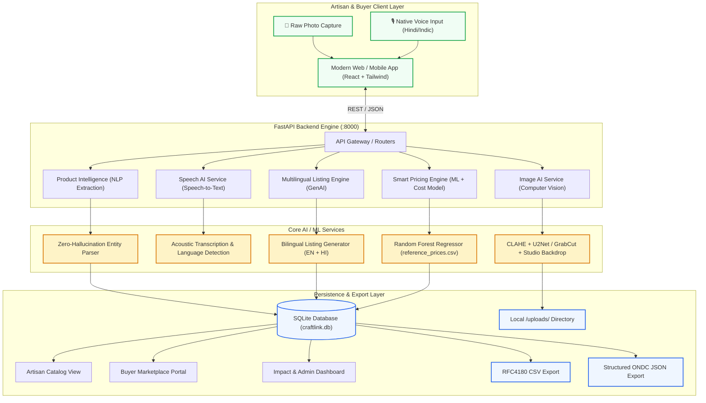

# CraftLink AI — System Architecture (SIH26090)

CraftLink AI is an end-to-end AI-driven market linkage and smart cataloging platform designed for rural Indian artisans and handloom weavers under the Ministry of Social Justice and Empowerment.

## High-Level Architecture Diagram

---

## Data Flow & Processing Pipeline

1. **Artisan Intake (Zero Tech Barrier)**:
   - Artisan takes a raw photograph of their craft on any messy surface (bedsheet, floor, cluttered workshop).
   - Artisan taps the microphone and speaks naturally in Hindi, English, or their regional dialect.
2. **Computer Vision Enhancement**:
   - `ImageService` applies Contrast-Limited Adaptive Histogram Equalization (CLAHE) on the L-channel of the LAB color space to lift dark shadows and reveal fine weave/carving textures.
   - Foreground segmentation isolates the craft from cluttered backgrounds and composites it onto a studio-grade neutral background with soft ambient grounding shadows.
3. **Speech-to-Text & Language Detection**:
   - `SpeechService` decodes the audio stream (WAV, MP3, WebM) and transcribes artisan speech with language identification.
4. **Anti-Hallucination Product Intelligence**:
   - `ProductIntelligenceService` maps spoken entities to structured craft taxonomy (`category`, `material`, `craft_type`, `technique`, `dimensions`, `production_time`, `region`).
   - Fields not mentioned by the artisan are strictly preserved as `"Not specified (Needs Confirmation)"` rather than hallucinated.
5. **Multilingual Listing Generation**:
   - `ListingService` generates high-converting e-commerce product titles, short marketplace summaries, storytelling rich descriptions, bulleted technical specifications, and SEO discovery tags in English and Hindi.
6. **Smart Fair-Trade Pricing Engine**:
   - Blends direct production economics (`Material Cost + Labor Cost + Packaging`) with craft complexity multipliers and a trained **Scikit-Learn Random Forest Regressor** trained on authentic Indian craft benchmark records (`reference_prices.csv`).
   - Computes minimum sustainable price, recommended fair-trade range, and suggested retail price with a complete "Why this price?" transparent reasoning breakdown.
7. **Artisan Verification & Digital Distribution**:
   - Artisan reviews confidence scores, edits any attribute if desired, and confirms publication into the digital catalog, buyer marketplace, and CSV/JSON export feeds.
