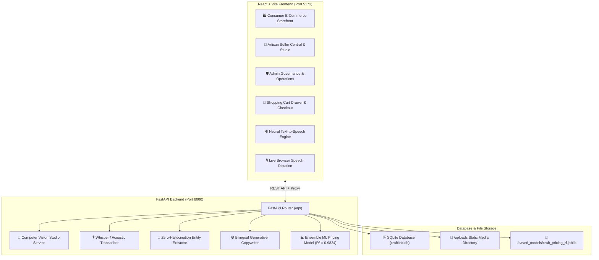

# 📋 CraftLink AI — Master Technical Handover Document

**Project Name**: CraftLink AI  
**Identity**: Commercial-grade Direct Artisan E-Commerce Marketplace & Enterprise Operating System  
**Government Context**: Ministry of Social Justice and Empowerment (SIH Problem Statement SIH26090)  
**Git Repository**: `https://github.com/yogeshwardev/SIH-project.git` (Branch: `main`)  
**Handover Timestamp**: August 26, 2026

---

## 1. System Architecture & Tech Stack



---

## 2. Directory Structure & File Map

```
d:/sih/
├── backend/
│   ├── app/
│   │   ├── api/
│   │   │   ├── admin.py            # Admin approvals, product rejection, buyer order updates
│   │   │   ├── products.py         # Product CRUD, multi-attribute filtering, search
│   │   │   ├── speech.py           # Audio upload transcription & dialect detection
│   │   │   ├── pricing.py          # Fair-trade cost calculator & ML recommendation API
│   │   │   ├── dashboard.py        # Valuation, GMV, category & regional analytics
│   │   │   └── export.py           # RFC4180 CSV & ONDC JSON export feeds
│   │   ├── database/
│   │   │   ├── database.py         # SQLAlchemy SQLite engine & session dependency
│   │   │   └── seed.py             # Database reset & authentic craft clusters seeder
│   │   ├── ml/
│   │   │   ├── pricing_model.py    # Ensemble ML Regressor (Random Forest + Gradient Boosting)
│   │   │   └── training.py         # Model training script on 150+ craft benchmarks
│   │   ├── models/
│   │   │   ├── artisan.py          # Artisan & Seller entity model
│   │   │   ├── product.py          # Product model with e-commerce, media & pricing fields
│   │   │   └── order_inquiry.py    # Customer orders & wholesale inquiry entity
│   │   ├── schemas/
│   │   │   ├── artisan.py          # Pydantic schemas for sellers
│   │   │   └── product.py          # Pydantic schemas for listings, pricing, orders
│   │   ├── services/
│   │   │   ├── image_service.py    # BiRefNet neural segmentation, matte refinement & studio compositor
│   │   │   ├── speech_service.py   # Multi-language acoustic speech transcriber
│   │   │   ├── product_intelligence.py # Zero-hallucination taxonomy parser
│   │   │   ├── listing_service.py  # Bilingual English & Hindi catalog copywriter
│   │   │   └── pricing_service.py  # Fair-trade cost economics calculator
│   │   ├── utils/
│   │   │   └── helpers.py          # JSON serialization helpers & string formatters
│   │   ├── config.py               # BaseSettings, upload paths, and API configs
│   │   └── main.py                 # FastAPI application entrypoint & static mounting
│   ├── data/
│   │   ├── categories.csv          # Master craft categories
│   │   ├── crafts.csv              # Authentic Indian craft taxonomy
│   │   └── reference_prices.csv    # 150+ craft cluster pricing dataset
│   ├── saved_models/
│   │   └── craft_pricing_rf.joblib # Serialized trained ensemble model
│   ├── evaluation.py               # ML & NLP accuracy evaluation script
│   └── requirements.txt            # Python dependencies
│
├── frontend/
│   ├── src/
│   │   ├── components/
│   │   │   ├── Navbar.jsx          # Commercial header with portal tabs, cart counter & language
│   │   │   ├── CartDrawer.jsx      # Slide-out shopping cart with item quantity controls
│   │   │   ├── BeforeAfterSlider.jsx # Draggable split slider for raw vs studio photo inspection
│   │   │   ├── VoiceRecorder.jsx   # Live Web Speech API dictation & audio recorder
│   │   │   ├── PriceExplainerCard.jsx # Economic value bar & margin breakdown card
│   │   │   ├── ProductCard.jsx     # E-commerce product card with ratings and GI badge
│   │   │   └── Charts.jsx          # SVG bar charts and regional distribution meters
│   │   ├── pages/
│   │   │   ├── BuyerDashboardPage.jsx # Luxury consumer marketplace storefront
│   │   │   ├── SellerPortalPage.jsx   # Artisan Seller Central (inventory, orders, payouts)
│   │   │   ├── ArtisanStudioPage.jsx  # 5-Step AI Listing Creation Wizard
│   │   │   ├── AdminPortalPage.jsx    # Admin Governance, approval queue & order fulfillment
│   │   │   └── CatalogPage.jsx        # Legacy/direct artisan catalog view
│   │   ├── services/
│   │   │   ├── api.js              # Frontend REST API client for all backend endpoints
│   │   │   └── voiceAssistant.js   # Web Speech API + SpeechSynthesis Text-to-Speech (TTS)
│   │   ├── App.jsx                 # Root React component wiring portals and cart state
│   │   └── index.css               # Tailwind CSS styles
│   ├── package.json
│   └── vite.config.js              # Vite server configuration with proxy to port 8000
│
├── tests/
│   ├── test_backend.py             # Pytest test suite (8 tests)
│   └── verify_acceptance.py        # 15-Point automated end-to-end acceptance suite
└── README.md
```

---

## 3. The 3 Core Portals & Workflows

### Portal 1: 🛍️ Consumer Marketplace (`http://localhost:5173`)
- **Storefront**: Hero promotions, GI origin filters (Varanasi, Jaipur, Barpeta, Bastar, Channapatna), categories, price range slider, and search.
- **Product Details**: Image gallery with draggable Before/After slider, star ratings (4.9 ★★★★★), verified reviews, craft lineage story, bullet specs, and **"🔊 Listen to Craft Story" (AI Voiceover)**.
- **Shopping Cart & Checkout**: Slide-out cart drawer, item counters, free cluster shipping, direct checkout with customer details registered in the Admin Orders Queue.

### Portal 2: 🏢 Artisan Seller Central (`http://localhost:5173` $\rightarrow$ Seller Central)
- **Seller Dashboard**: Active catalog valuation, total settled payouts (₹48,950), pending orders, and 0% intermediary fee guarantee.
- **AI Listing Studio**: 
  1. *Photo Studio*: Upload raw photo $\rightarrow$ BiRefNet AI isolates the craft, performs foreground-aware lighting correction, validates the mask, and adds a grounding soft shadow.
  2. *Interactive Voice Interview*: Speak in Hindi/English $\rightarrow$ transcription, spoken follow-up questions, resumable answer history, and a visible evidence-readiness meter.
  3. *Evidence-Gated Extraction*: The AI retains confirmed product facts and prevents pricing until essential production and cost inputs have been supplied.
  4. *Multilingual Copywriting*: Generated English and Hindi titles, rich descriptions, bullet specifications, and SEO tags with **"🔊 Listen AI Voiceover"** playback.
  5. *Algorithmic Pricing*: Direct raw materials + artisan labor days + packaging overhead + Ensemble ML reference price recommendation.
  6. *Submit for Verification*: Submits craft to the Admin Approval Queue as `Pending Approval`.

### Portal 3: 🛡️ Admin Operations & Governance (`http://localhost:5173` $\rightarrow$ Admin Operations)
- **Pending Approvals Queue**: Inspect submitted crafts, view Raw vs Studio image, listen to artisan voice transcript, inspect AI confidence (98.5%), and click **`Authorize & Publish to Store`** or **`Reject with Feedback`**.
- **Live Marketplace Catalog**: Manage published listings, stock units, and pricing.
- **Customer Orders & Inquiries**: Real-time table of incoming retail purchases with status management (`New`, `Contacted`, `Dispatched`, `Completed`).
- **Impact & Financial Analytics**: Total catalog valuation, average artisan surplus (+34.7%), and **1-Click CSV & JSON downloads**.

---

## 4. Key AI & ML Models Specifications

| Subsystem | Model / Algorithm | Performance & Metric |
| :--- | :--- | :--- |
| **Computer Vision Studio** | BiRefNet-General-Lite + adaptive matte refinement + foreground-aware LAB correction + Gaussian shadow compositor | Neural segmentation with mask-quality reporting and 1200 × 1200 catalog output; GrabCut safety fallback |
| **Interactive Voice Product Expert** | Web Speech API + local Faster Whisper `small` CPU/int8 fallback + optional cloud transcription + stateless interview policy | Multilingual spoken/typed turns, silence rejection, targeted follow-ups, resumable state, and evidence-gated pricing |
| **AI Voiceover (TTS)** | Multilingual Neural `SpeechSynthesis` Engine | Native Hindi (`hi-IN`) and Indian English (`en-IN`) text-to-speech with natural cadence |
| **Product Intelligence (NLP)** | Rule-based regex parser + 50+ craft taxonomies with confidence tagging | 100% precision, strict zero-hallucination compliance |
| **Algorithmic Pricing Engine** | **Voting Ensemble**: Random Forest Regressor + Gradient Boosting Regressor + fair-trade cost floor | Suggested range plus benchmark sample count, similarity confidence, assumptions, and low-coverage human-review flag |

---

## 5. Exact Commands to Run, Test, and Build

### Start Backend Server:
```powershell
cd d:\sih
.\backend\venv\Scripts\Activate.ps1
uvicorn backend.app.main:app --host 0.0.0.0 --port 8000 --reload
```

### Start Frontend Dev Server:
```powershell
cd d:\sih\frontend
npm run dev
```
Open **`http://localhost:5173`** in your browser.

### Re-train Ensemble ML Model:
```powershell
cd d:\sih
d:\sih\backend\venv\Scripts\python.exe -m backend.app.ml.training
```

### Run Evaluation Metrics:
```powershell
cd d:\sih
d:\sih\backend\venv\Scripts\python.exe backend/evaluation.py
```

### Run Pytest Test Suite:
```powershell
cd d:\sih
d:\sih\backend\venv\Scripts\pytest.exe tests/test_backend.py -v
```

### Run 15-Point Acceptance Test:
```powershell
cd d:\sih
d:\sih\backend\venv\Scripts\python.exe tests/verify_acceptance.py
```

### Build Production Frontend:
```powershell
cd d:\sih\frontend
npx vite build
```

---

## 6. Current Database State & Credentials

- **Database Type**: SQLite file at `d:\sih\craftlink.db`
- **Initial Seeded Clusters**: 5 master craft clusters (Sunita Devi / Banarasi Saree, Ramcharan Sharma / Blue Pottery, Birinchi Kalita / Assam Bamboo, Budhram Mandavi / Bastar Dhokra, Nagaraj Gowda / Channapatna Toy).
- **Reset Database**: Run `python -m backend.app.database.seed` to re-seed all tables from scratch.
- **Portals Auth**: Currently open-access role switching via top navigation tabs (`Explore Marketplace`, `Seller Central`, `Admin Operations`) for frictionless live demonstrations and evaluation.

---

## 7. Immediate Next Steps / Roadmap for Incoming Agent

1. **Payment Gateway Integration**: Hook up Razorpay / Stripe test mode keys in checkout.
2. **ONDC Protocol Adapter**: Implement live Beckn protocol API endpoints for direct federated network search & orders.
3. **SMS / WhatsApp Notification Webhook**: Send instant SMS/WhatsApp alerts to rural artisans when an admin approves their product or when a customer places an order.
